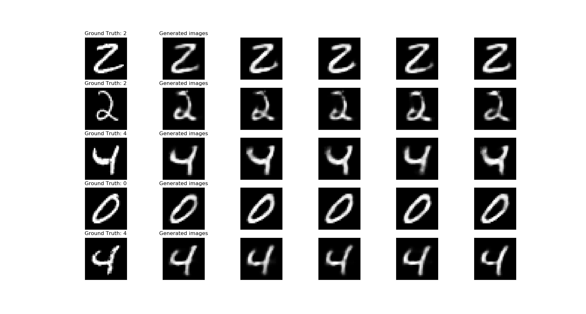
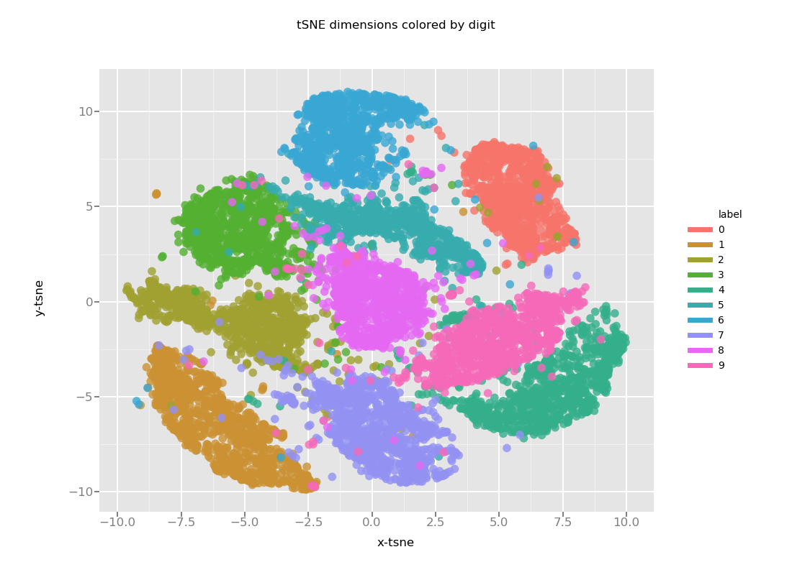

# VAE-Classifier
We will use a Variational Auto-encoder as a feature extraction tool and a logistic regressor to make the classification. The type of combination of unsupervised/supervised learning can be used when we have a lot of data but not much labeled data. 

# Anaconda environment

```
conda env create --file requirements.yml
```

# 1- Variational AutoEncoder

The variational Autoencoder encodes the data into a latent representation and then generates an image.  We can use the variational lower bound


where

- p(z) is the prior N(0,1)

- the second term is the reconstruction loss

- the first term is the  Kullback-Leibler divergence between the prior and the latent representation. It acts as a regularization term 

- phi is the encoder parameters
- theta is the decoder parameters 


Notes:

- Decoder is a Bernouilli MLP
- Latent representation is a vector of normal distributions


We are can see the images generated with the latent representation of some original images. 



At iteration 1, the representation is still mixed between different digits.


At iteration 31, there is a clearer separation between the representation of different digits. 



# 2 - Classifier

For the classifier, we used the freeze the encoder from the Variational Auto-encoder so it can be used as a feature extraction tool. We used a logistic regression on the latent representation for classification. Since the latent representation is generated randomly, we have a regularization that is made automatically.  


The accuracy of the model is 84% which is low for the problem at hand. Used a convolution network would be more appropriated image classification. 


